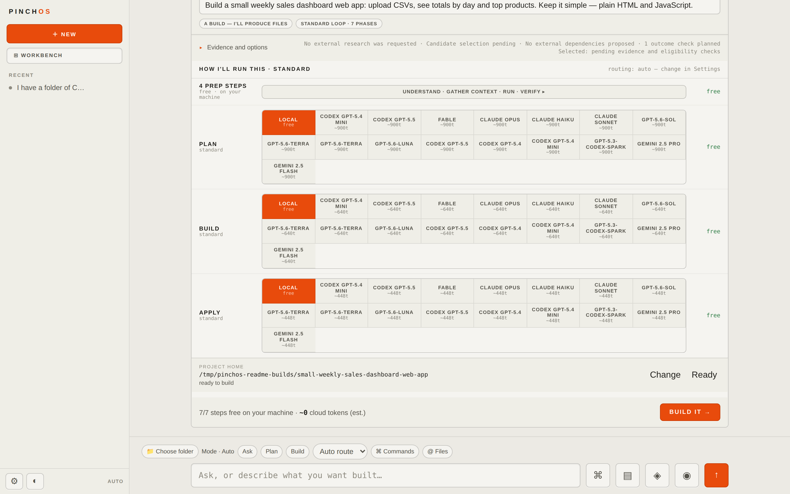
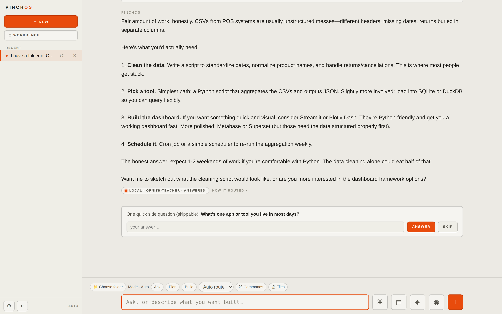
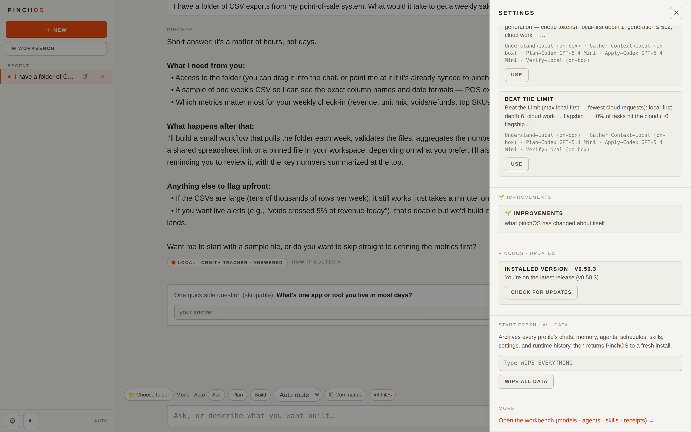
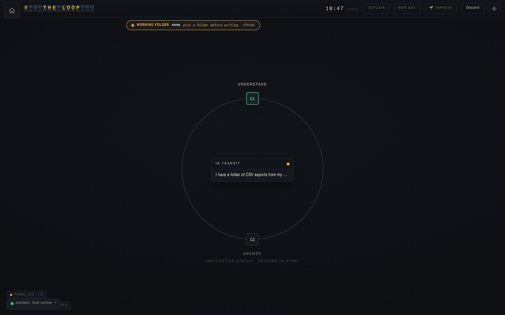

# pinchOS downloads

## Real AI work, with a visible plan and a result you can verify.

This is the stable binary channel for **pinchOS**: a local-first operating system for AI work. It keeps your
plan, model route, permissions, progress, artifacts, and verification receipts visible—and it blocks honestly
when the requested outcome cannot yet be proved.

**Current stable release: v0.50.4**



*A build ask becomes a priced plan before anything runs: the phases, a per-phase model route you can swap, the
working folder, and the cloud-token estimate — here, 7/7 steps free on the local machine.*

## Install

### Linux and macOS

```bash
curl -fsSL https://raw.githubusercontent.com/kwad77/pinchos-dist/main/install.sh | sh
pinchos
```

Then open [http://localhost:4147/chat](http://localhost:4147/chat) to start work, or
[http://localhost:4147/stage](http://localhost:4147/stage) to follow the Workroom.

### Windows and manual downloads

Download the matching asset from [the latest stable release](https://github.com/kwad77/pinchos-dist/releases/latest):

| Platform | Asset |
| --- | --- |
| Linux x64 | `pinchos-linux-x64` |
| Linux ARM64 | `pinchos-linux-arm64` |
| macOS Apple Silicon | `pinchos-darwin-arm64` |
| Windows x64 | `pinchos-win32-x64.exe` |

The binaries include Node and do not require a separate Node installation. macOS Intel and Windows ARM64 can run
from source for now.

## What you get in v0.50.4

- **A real Workroom:** turn an outcome into a visible, bounded run with a plan, model route, budget, working folder,
  approvals, artifacts, and proof.
- **Verification that means something:** commands, APIs, process health, restart behavior, browser journeys, served
  assets, and artifact identity can all be part of a delivered outcome.
- **Safe revisions:** accepted artifacts remain immutable while you inspect a candidate, compare versions, and choose
  whether to accept, retry, or discard it.
- **Model freedom:** use local OpenAI-compatible runtimes, subscription CLIs such as Codex or Claude, or configured
  APIs. Your context and verification contracts remain provider-independent.
- **Honest model inventory:** discovered, configured, reachable, measured, and eligible are distinct states. Missing
  credentials, provider loss, and unsupported hardware remain visible as missing capacity—not fake quality scores.
- **Bounded local onboarding:** no silent model download; benchmarks require a local-only preview confirmation and can
  be cancelled.
- **Governed learned routing:** deterministic routing is the default. Verified-only learned routing is explicit opt-in,
  respects every privacy/permission/budget constraint, explains its choice, and rolls back immediately.
- **Durable continuity:** exact-profile Work history, artifacts, branches, portable context, memory, SSE/API/SDK,
  IDE, TUI, and browser projections tell the same story.
- **Managed-build onboarding:** fresh installer-created build folders recover cleanly without requiring a manual
  Pincher indexing step before the first run.
- **Faster local long phases:** long local reasoning phases default to answer-first behavior, avoiding hidden-token
  stalls while preserving the explicit opt-in reasoning path.
- **Safer generated files:** in-target absolute paths are normalized to the selected build folder, and bounded
  filtered receipt checks are verified mechanically.
- **Settings that finish the job:** see the installed version, check the stable release channel, upgrade with a
  verified staged install, or archive all runtime data and return to a fresh instance.
- **No dead ends on file references:** referencing workspace files with `@` before a folder is chosen offers the
  folder picker right in place, and a persistent folder chip beside the composer shows the working folder at all
  times.
- **Answers that see your folder:** every reply in a folder-bound conversation carries the folder's actual
  contents — ask "what's in this repo?" and get the real files, not a shrug.
- **Commands that finish:** slash commands complete from any conversation, and typing `/` autocompletes
  against the server catalog (Tab completes).
- **Updates that come to you:** on start, chat checks the release channel once and offers an available
  update right in the conversation — staged download, verified install, explicit restart. "Later" snoozes
  that version.



*A plain question stays a plain answer. The receipt under it names the model that actually answered and expands
into how the turn was routed.*



*New in v0.50.2: the installed version and release-channel status live in Settings, next to the guarded reset —
typed confirmation required, every profile's data archived before the instance returns to a fresh install.*

## The important boundary

pinchOS never treats a model claim as proof. It will not:

- call unverified work successful;
- silently switch a user-selected model and pretend it did not;
- use a remote provider for local-only Work;
- call discovered hardware or a signed-out provider “ready”; or
- bury a missing credential, outage, or failed critical check.

When it cannot prove the result, it gives you the block and the next action.



*The Stage's loop scene: the ask travels a verification circuit that returns to where it started. Nothing lands
without passing the gates on the way back.*

## Verify a download

Each stable release includes `SHA256SUMS`, generated after all four binaries are downloaded and checked.

```bash
# Linux
sha256sum --check SHA256SUMS

# macOS
shasum -a 256 pinchos-darwin-arm64
```

Compare the printed digest with the matching line in `SHA256SUMS`.

macOS binaries are ad-hoc signed, not Apple-notarized. The installer removes quarantine from the exact downloaded
file. For a manual download:

```bash
xattr -d com.apple.quarantine ./pinchos-darwin-arm64
chmod +x ./pinchos-darwin-arm64
```

## Stable and beta channels

The installer uses this repository’s latest stable release. To request the newest prerelease:

```bash
curl -fsSL https://raw.githubusercontent.com/kwad77/pinchos-dist/main/install.sh | sh -s -- --beta
```

Prereleases never replace the stable channel automatically.

## Release integrity

1. The pinchOS source repository tags a version-matched, verified source commit.
2. Its Release binaries workflow builds each platform on a native GitHub runner.
3. All four source assets must succeed before publication.
4. This repository downloads the exact source assets, verifies their names and sizes, generates `SHA256SUMS`, and
   verifies checksums before promotion.
5. Only then is this stable channel updated.

## Documentation

pinchOS is developed in a private source repository; the binaries here are promoted from its tagged, verified
releases. The product documents itself in place: every surface shows the receipts behind its claims, the Stage
explains each phase as it runs, and Settings covers models, routing, updates, and reset.

- [Latest binary release](https://github.com/kwad77/pinchos-dist/releases/latest)
- [All releases](https://github.com/kwad77/pinchos-dist/releases)

## License

Copyright (c) 2026 the pinchOS authors. All rights reserved. See [LICENSE](LICENSE) and [NOTICE](NOTICE) in this
repository for the terms that govern use and distribution.
