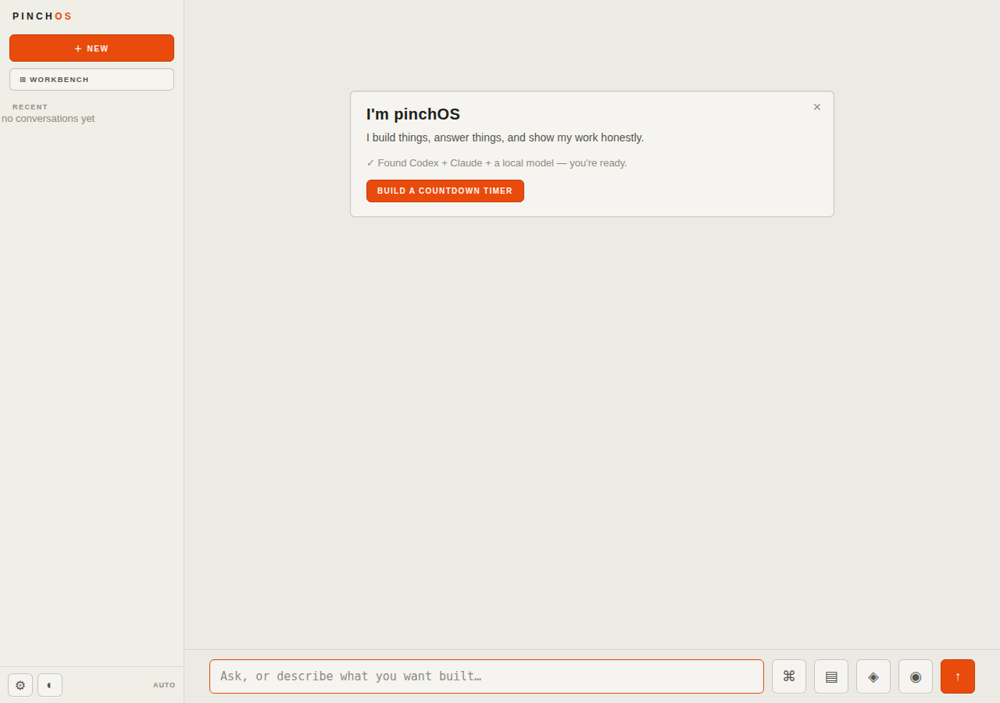
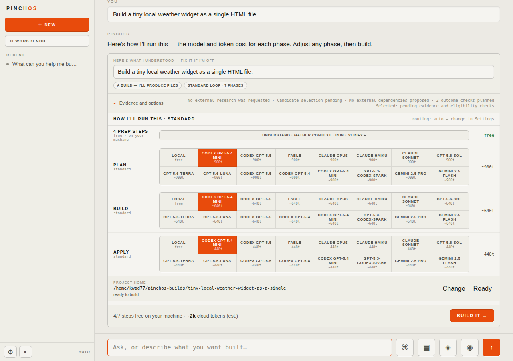

<div align="center">

# pinchOS

**A local-first operating system for getting real work from AI — with the plan, the model choices, the progress, and the proof all visible before and while it runs.**

Give it an outcome. It proposes a proportional plan, shows you exactly which model does each
phase and what it costs, builds against your files, verifies the result for real, and keeps the
receipts.

[](https://github.com/kwad77/pinchos-dist/releases/latest)
[](#install)
[](#models)
[](#the-honesty-part)

[Install](#install) · [See it in action](#see-it-in-action) · [Using it](#using-it) ·
[Verify a download](#verify-a-download) · [Models](#models) · [Limitations](#known-limitations)



</div>

---

## Why this exists

AI can generate an answer fast. What's hard is knowing whether it understood the request, used
the right context, changed the actual files, connected the pieces, ran the relevant checks, and
delivered what you asked for — instead of something that just *looks* finished.

pinchOS is the missing layer around the model:

- **Context** — your working folder, remembered facts and corrections, prior artifacts, and
  connected tools, pulled in only where relevant instead of dumped into every prompt.
- **Control** — the proposed plan, its phases, the model assigned to each one, the token budget,
  and the target folder are shown to you before anything runs, and stay editable while it does.
- **Execution** — a plan becomes one coherent, working artifact instead of a pile of disconnected
  model replies.
- **Verification** — real commands, real checks, real restarts, before the result is ever called
  done.
- **Continuity** — an append-only history and immutable artifact versions, so a failed attempt
  leaves you an exact receipt instead of a blank page.

The rule underneath all of it: **an end state where you didn't get what you asked for is not a
success**, no matter how confident the write-up sounds.

## See it in action

Ask it something, and it answers straight — grounded in what it actually has access to, with a
quick, skippable side-question so it learns how you like things written:


Ask it to build something, and before anything runs you get a **priced plan**: the phases it will
run, the exact model assigned to each one (with per-phase token estimates), the working folder,
and a single button to actually start it.



That's the whole idea in two screenshots: nothing runs, and nothing costs anything, until you can
see exactly what it's going to do.

## Install

Linux and macOS:

```bash
curl -fsSL https://raw.githubusercontent.com/kwad77/pinchos-dist/main/install.sh | sh
```

Open a new terminal and run:

```bash
pinchos
```

Then open **[http://localhost:4147](http://localhost:4147)**.

The installer:

1. detects your OS and CPU architecture;
2. downloads the matching binary from the latest stable release;
3. installs it to `~/.local/bin` by default and adds that to your shell path if needed; and
4. installs [Pincher](https://github.com/kwad77/pincher), the grounding/indexing engine,
   alongside it on Linux and macOS when a compatible release is available.

Set `PINCHOS_BIN_DIR` to install somewhere else. Set `PINCHOS_SKIP_PINCHER=1` to skip the
grounding engine.

Windows and unsupported architectures: grab the matching asset from the
[latest release](https://github.com/kwad77/pinchos-dist/releases/latest) manually.

## Using it

pinchOS starts a local runtime with two front doors:

- **`/chat`** — the front door. Ask a question, attach a spec, point it at an existing project, or
  describe something to build. Small asks answer directly; anything that needs real work gets the
  priced plan shown above.
- **`/stage`** — the Workroom. Everything Chat kicked off lives here while it runs: current phase,
  elapsed time and remaining budget, live explanations of what it's doing and why, the working
  folder, concurrent jobs, stop controls, and settings for models, loops, and connectors.

A delivered artifact opens in a sandboxed preview with its verification receipt attached. You can
revise it in place — select a region, say what should change, review the proposed diff, and
accept, adjust, retry, or discard — without pinchOS throwing away the version you already accepted
and starting over.

### Terminal client

If you'd rather stay in the terminal, leave the runtime running in one terminal and open a second:

```bash
pinchos chat
```

It's a full terminal chat client against the same runtime — streaming replies, live phase
progress, clarification prompts, and plan selection, all without a browser.

### What it can actually do

| | |
|---|---|
| **Conversation** | Grounded answers, file/image/doc attachments, streaming replies, remembered facts and corrections |
| **Builds** | New apps, edits to an existing project, build-from-spec, explicit folder targeting |
| **Work orchestration** | Built-in and custom multi-phase loops, per-phase model routing, stop/resume, multiple concurrent jobs |
| **Models** | Local OpenAI-compatible endpoints, installed Claude/Codex subscriptions, explicit per-phase choice |
| **Verification** | Real commands, tests, APIs, process health checks, browser checks — not a model's opinion of its own work |
| **Revisions** | Region selection, discussion, reviewed change contracts, immutable versions, before/after comparison |
| **Memory** | Profile-scoped facts and corrections that carry across conversations, with provenance |

### Configuration

Most of it lives in Workroom settings. Useful environment overrides:

```bash
PINCHOS_PORT=4147
PINCHOS_DATA_DIR=/path/to/private/runtime-data
PINCHOS_MODEL_URL=http://localhost:11434/v1
PINCHOS_MODEL_NAME=your-model
PINCHOS_MODEL_COMMAND="your command-backed model"
```

## Models

pinchOS is the context and verification layer, not a model vendor. It can use:

- a local OpenAI-compatible endpoint (Ollama, LM Studio, vLLM, or any other `/v1` server);
- an installed Claude or Codex subscription CLI; or
- an explicitly configured command-backed agent.

It probes what's actually available on your machine and offers real, working choices — it doesn't
show a provider as connected when it isn't, or quietly swap out a model you explicitly picked.

**No model is bundled.** The binary can't ship a multi-gigabyte local model or a subscription for
you. Without one configured, pinchOS still starts, still answers from an honest offline fallback,
and tells you exactly what to connect.

## The honesty part

This is the part pinchOS is actually built around:

- a result isn't called `VERIFIED` because of the name of the phase that ran it — it's verified
  because something executed and passed;
- a build isn't presented as landed until the files actually exist at the folder you were shown;
- a missing dependency or credential stays honestly blocked, not silently skipped;
- self-improvement can propose a reviewed change to itself, but it can't relax its own check to
  get there.

## Known limitations

Real boundaries, not fine print:

- **Ambitious builds are still slow.** Real multi-phase verification takes real time — this trades
  speed for a much higher chance the result actually works.
- **A model is external.** See [Models](#models) above — nothing is bundled.
- **External services can block honestly.** A missing credential, a rate limit, or an unreachable
  source can stop a live workflow rather than fake its way past it.
- **Very large or unusual repositories are still a risk.** Broad grounding helps, but not every
  toolchain and repo shape has been proven out yet.

## Verify a download

Every stable release publishes `SHA256SUMS` alongside the four platform binaries, generated only
after this repository's promotion workflow has re-downloaded and byte-verified each asset from the
signed source build.

Linux:

```bash
sha256sum --check SHA256SUMS
```

macOS:

```bash
shasum -a 256 pinchos-darwin-arm64
# compare against the matching line in SHA256SUMS
```

The macOS binary is ad-hoc signed, not Apple-notarized. The installer removes the quarantine
attribute from the exact file it downloads; a manual install needs to do that itself:

```bash
xattr -d com.apple.quarantine ./pinchos-darwin-arm64
chmod +x ./pinchos-darwin-arm64
```

### How a release gets here

The build and the publish are deliberately separate decisions:

1. `kwad77/pinchOS` (private source) tags a release and builds all four platform binaries natively,
   one per OS.
2. This repository's promotion workflow downloads those exact source assets, checks their sizes
   against what the source release advertises, and only then generates `SHA256SUMS`.
3. Only a fully-verified set gets published here and pointed at by `releases/latest`.
4. A follow-up workflow independently re-checks the published release: the right assets, the right
   checksums, nothing missing.

## Stable and beta channels

The installer above uses this repository's `latest` stable release. To try the newest source
prerelease instead:

```bash
curl -fsSL https://raw.githubusercontent.com/kwad77/pinchos-dist/main/install.sh | sh -s -- --beta
```

Prereleases are never promoted to the stable channel here.

## Source and issues

pinchOS's source repository is private during this stage of development — the binaries here are
the supported way to run it. Found a problem with a download, the installer, or something you're
seeing in the app? Open an issue [in this repository](https://github.com/kwad77/pinchos-dist/issues).

## License

Copyright (c) 2026 the pinchOS authors. All rights reserved. The software is proprietary — see
[LICENSE](LICENSE) and [NOTICE](NOTICE) in this repository for the exact terms and third-party
attributions.
